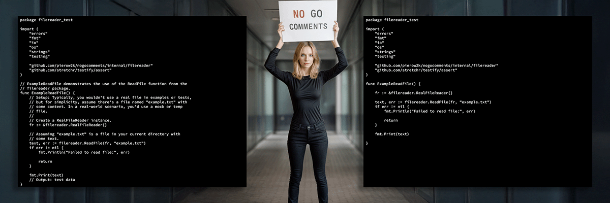
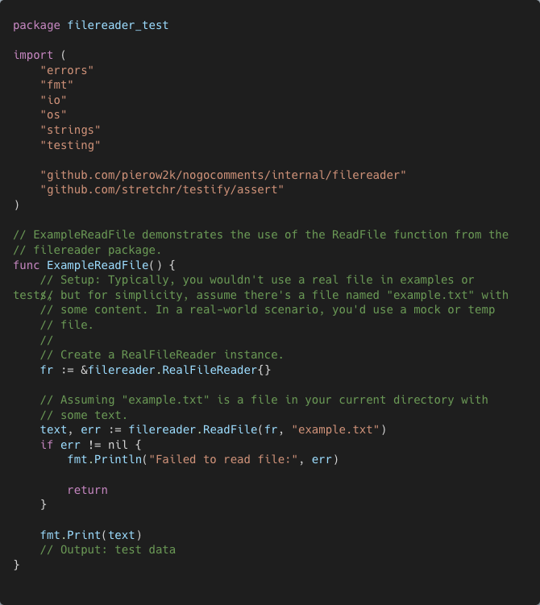
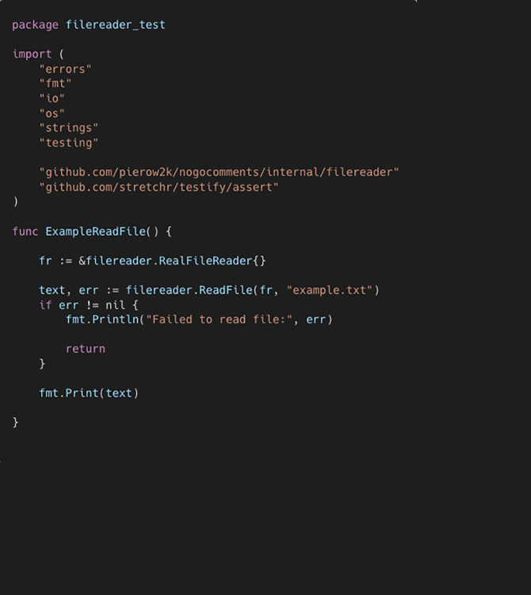

# nogocomments

  


[](https://app.codacy.com/gh/pierow2k/nogocomments/dashboard?utm_source=gh&utm_medium=referral&utm_content=&utm_campaign=Badge_grade)

**nogocomments: Instantly Remove Comments from Your Go Code**

**nogocomments** is a command-line tool designed to simplify the process of removing comments from Go source code. Whether you're preparing code snippets for sharing, streamlining code reviews, or processing Go code programmatically, **nogocomments** is a fast and reliable solution. By focusing on efficiency and simplicity, it ensures that your code is ready for any context where comments might not be needed.

| Before                                           | After |
|--------------------------------------------------|----------------------------------------------------|
|  |  |


**Start streamlining your Go code today with nogocomments!**

<details closed="closed">
  <summary><h2 style="display: inline-block">Table of Contents</h2></summary>
  <ul>
    <li><a href="#installation">Installation</a></li>
    <li><a href="#usage">Usage</a></li>
    <li><a href="#examples">Examples</a></li>
    <li><a href="#contributing">Contributing</a></li>
    <li><a href="#license">License</a></li>
  </ul>
</details>

## Installation

### Precompiled Binaries

Download precompiled binaries for your platform from the [Releases](https://github.com/pierow2k/nogocomments/releases) page.

### Install Using `go install`

Ensure [Go](https://golang.org/dl/) is installed, then run:

```bash
go install github.com/pierow2k/nogocomments@latest
```

### Clone and Build

For manual builds, clone the repository and build using `go build`. This requires Go to be installed.

```bash
git clone https://github.com/pierow2k/nogocomments.git
cd nogocomments
go build
```

## Usage

```bash
nogocomments [OPTIONS]
```

### Options

| Option           | Description                                      |
|------------------|--------------------------------------------------|
| `--debug`        | Enable debug level logging for verbose output.   |
| `--file <path>`  | Specify the file path containing Go source code. |
| `--paste`        | Read Go source code from the system clipboard.   |
| `--version`      | Display version and build information.           |

## Examples

Remove comments from Go source code copied to the clipboard:

```bash
nogocomments --paste
```

Process comments from a Go source file and output to the terminal:

```bash
nogocomments --file /path/to/your/file.go
```

Write processed output to a new file:

```bash
nogocomments --file /path/to/your/source.go > newfile.go
```

Enable debug mode for detailed logs:

```bash
nogocomments --debug --file /path/to/your/file.go
```

## Contributing

We love community contributions! Here's how you can get involved:

- **Report Issues**: Found a bug or have a feature request? Let us know by [opening an issue](https://github.com/pierow2k/nogocomments/issues).
- **Submit a Pull Request**: If you've improved the tool or fixed an issue, [submit a pull request](https://github.com/pierow2k/nogocomments/pulls). Contributions are always welcome!

Your feedback and contributions make `nogocomments` better for everyone. Thank you for helping grow and refine this project!

## License

This project is licensed under the MIT License. See the [LICENSE](LICENSE) file for details.
