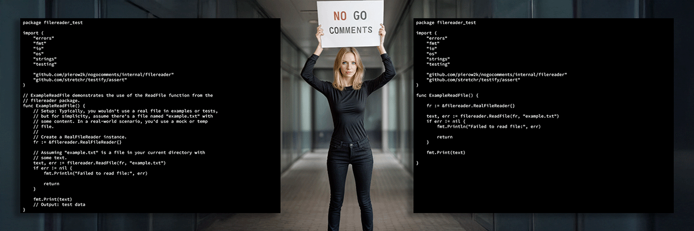
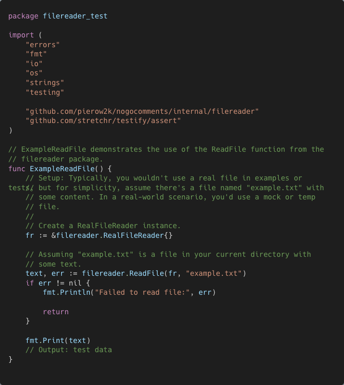
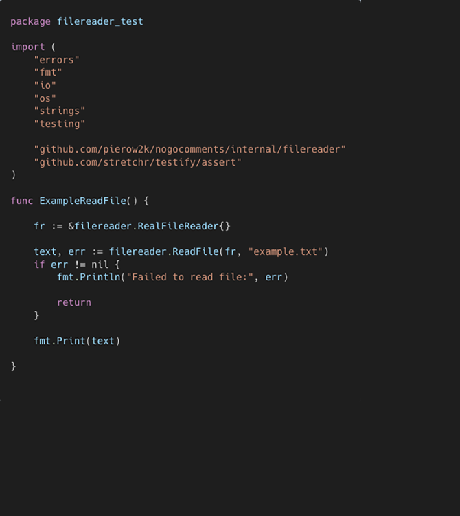

<!-- markdownlint-disable no-inline-html no-emphasis-as-heading first-line-h1 -->
# nogocomments

<div align="center">

  

[](https://app.codacy.com/gh/pierow2k/nogocomments/dashboard?utm_source=gh&utm_medium=referral&utm_content=&utm_campaign=Badge_grade)


**Instantly Remove Comments from Your Go Code**

</div>

**nogocomments** is a command-line tool designed to simplify the process
of removing comments from Go source code. Whether you're preparing code
snippets for sharing, streamlining code reviews, or simply trying to
frustrate a co-worker, **nogocomments** is a fast and reliable solution. By
focusing on efficiency and simplicity, it ensures that your code is ready
for any context where comments might not be needed.

| Before                                           | After |
|--------------------------------------------------|----------------------------------------------------|
|  |  |

<!-- TABLE OF CONTENTS -->
<details closed="closed">
  <summary>
    <h2 style="display: inline-block">Table of Contents</h2>
  </summary>

- [Installation](#installation)
- [Usage](#usage)
- [Examples](#examples)
- [Contributing](#contributing)
- [License](#license)

</details>

## Installation

Download precompiled binaries for your platform from the
[releases](https://github.com/pierow2k/nogocomments/releases) page.

## Usage

```bash
nogocomments [INPUT_FILE] [flags]
```

**Flags:**

| Short | Long        | Description                              |
| :---: | :---------- | :--------------------------------------- |
| `-d`  | `--debug`   | Enable debug (verbose) logging           |
| `-h`  | `--help`    | Show help                                |
| `-p`  | `--paste`   | Read code from clipboard                 |
| `-v`  | `--version` | Show version, build details, and license |

Note: Each `nogocomments` release ships with a man page in `troff`
(standard man page) format and [PDF format](./doc/nogocomments.1.pdf).

## Examples

Remove comments from Go source code that has been copied to the clipboard:

`nogocomments --paste`

Remove comments from a Go file and print the result to the terminal:

`nogocomments --file /path/to/your/file.go`

Remove comments from a Go file and write the result to a new file:

`nogocomments --file /path/to/your/source.go > newfile.go`

Enable debug mode for more detailed logs:

`nogocomments --debug --file /path/to/your/file.go`

Print the version, build details, and license information:

`nogocomments --version`

## Contributing

- Add a [GitHub Star](https://github.com/pierow2k/nogocomments).
- Have an idea for a new feature or noticed something that isn’t working
  quite right? [Open an issue](https://github.com/pierow2k/nogocomments/issues).
- If you’ve made improvements or fixed a bug,
  [submit a pull request](https://github.com/pierow2k/nogocomments/pulls).

## License

nogocomments is distributed under the MIT License. See the
[LICENSE](LICENSE) file for more details.
